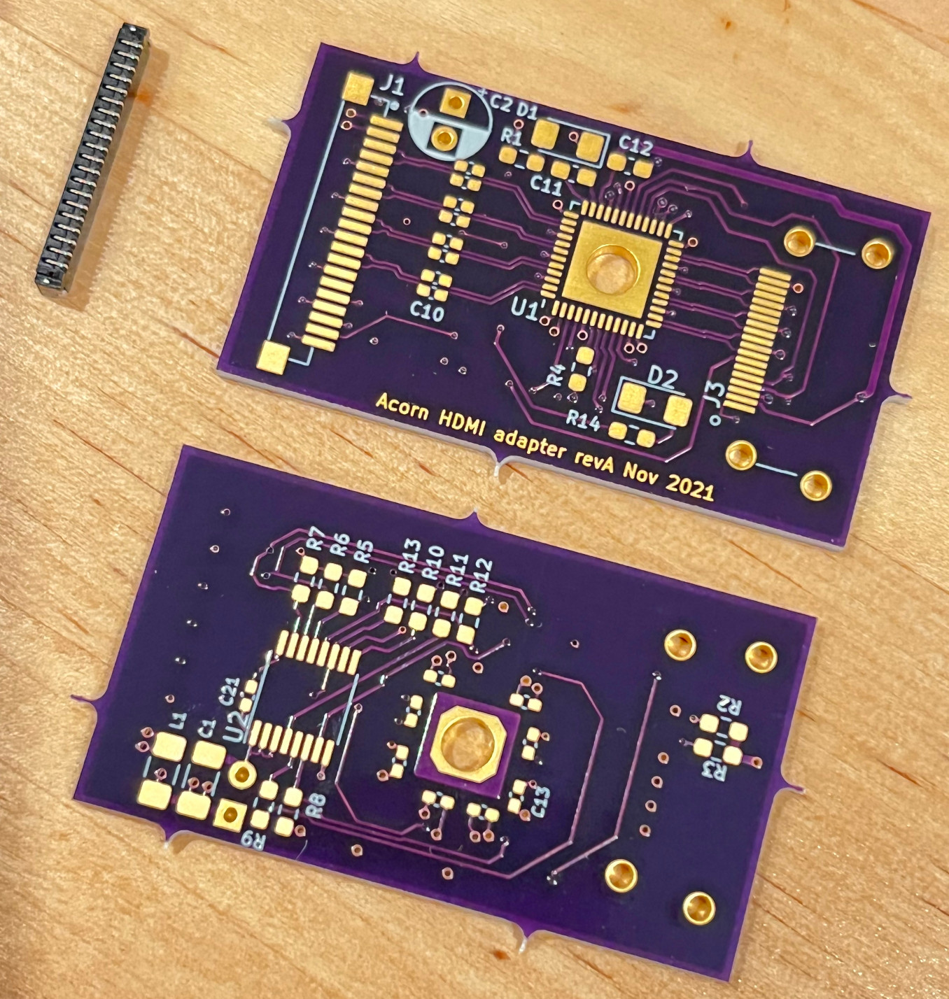

# AcornHDMI
This is a design for a DVI/HDMI buffer, for use with the SQRL Acorn, an Artix-7 FPGA board originally intended for mining. It should also work with the RHS Research NiteFury/LiteFury, which are based on the same design as the Acorn.

Current status: revision A boards were assembled in late 2021. Working on bringup: [AcornHDMI-demo](https://github.com/mng2/AcornHDMI-demo)

## Why
The SQRL Acorn CLE-215+ consists of the largest Artix-7 FPGA, some DDR3 memory, and associated support circuitry. Since it was designed as an accelerator board in M.2 format, it does not have much in the way of user I/O, merely 4 LVDS pairs on a 2.5V bank, and 2 pairs on a 3.3V bank.

Four pairs banked together is not much, but it is just enough for a DVI or HDMI interface to an external monitor. The remaining issue is the physical layer: while Xilinx does support a TMDS I/O standard on this FPGA, it's only on 3.3V banks and the four pairs are on 2.5V. There are several ways to fix this, such as modding the board, but the more boring approach is to add a chip designed for the purpose. Plus if you're going to have to lay out a PCB anyway for the connectors, might as well make a whole project of it! (Says the guy with too many projects...)

For this board the PTN3381B fits the bill. Besides buffering into TMDS outputs, it handles level shifting for the Display Data Channel interface and hotplug detect, and generates 5V for the downstream device. Plus it does some other things that are probably unnecessary.

## Chips Used
- **PTN3381B** (NXP): 
NXP makes a number of video interface translation chips, including this one which seems to be intended to take DisplayPort (electrical-wise) and output TMDS. Each input is capacitively coupled and terminated into 50 ohms, so in theory an LVDS diff pair will "see" the 100 ohms it expects. The B version of the part supports up to 1.65 Gbit/s operation, and the D version supports 3 Gbit/s; however a -3 speed grade Artix-7 only goes up to 1250 Mbit/s, so the D is overkill. From a cursory examination, the only difference in the pinout is how the pre-emphasis is configured, so it should be possible to support both models. (Note that the D version is going EOL.)
- **PCA9534** (NXP, TI): 
This is an I2C expander with 8 bits of real FET drive output, as opposed to the weird weak drive that other models use. The I/O bits are used to configure the PTN3381 for the most part. One output is earmarked for the statutory minimum complement of one (1) blinkenlight. CEC is a stretch goal...

## Connectivity
The Acorn has the relevant I/O on a Hirose DF52 connector. This 0.8mm pitch system is a wonder of engineering but not too much fun to play with. Your faithful correspondent has tried and failed to make a 3M 7700-series based DF52 cable, and can only recommend the use of Hirose's pre-crimped wires. If only they were a little bit cheaper...

## PCB Design
This board was designed in KiCAD 5.1.something, with OSH Park's 4-layer board service in mind. The total area is a bit under 1.5 square inches, which translates to ~$15 for 3 copies. The differential pairs are constrained for the defined stackup, with ground on layer 2, though connections are pretty short and there was no attempt to length-match.

My board design philosophy is to not push the limits if there's no need to, so while the spec at OSH Park is 5/5, I chose to use widths starting at 6 mils. There is one DRC complaint, eminently ignorable, which is that the silk for C2 slightly overlays the pad for C3.

Note that this board uses HLV technology for the QFN pad. HLV (Hilariously Large Via) technology is probably incompatible with reflow processes -- this layout was designed for hand soldering, and utilizes the "hand soldering" variants of the surface mount components in the default library. If you intend to do reflow you will want to redesign with the appropriate footprints. (Or do the HLV by hand, or perhaps it is OK? With small vias the solder tends to get sucked in, pulling the part down to the board. It may be less of an issue for standard QFNs.)

## Assembly
* The secret to SMT assembly is magnification. Things are not so difficult when you can see them. I would not try to put this together without some kind of microscope or USB microscope.
* The other secret is experience. I think some experience with fine-pitch soldering is necessary. 
Speaking for myself, knowing how to recover from making a mess is essential, using flux and braid.
* A fine-pitch temperature-controller soldering iron is advised, or hot air. I think I used Hakko tip T18-C05, a fine beveled shape. This is more for the QFN and fine-pitched stuff, 0603 and up benefits from the heat transfer of something bigger.
* I would put U1 and the backside 0402s on first, they are harder to deal with when the board does not lie flat. 

## Errata
* LEDs too bright. I designed for 10mA but I would aim for 1mA or less.

## Links

## License
CERN OHL v2 Permissive
